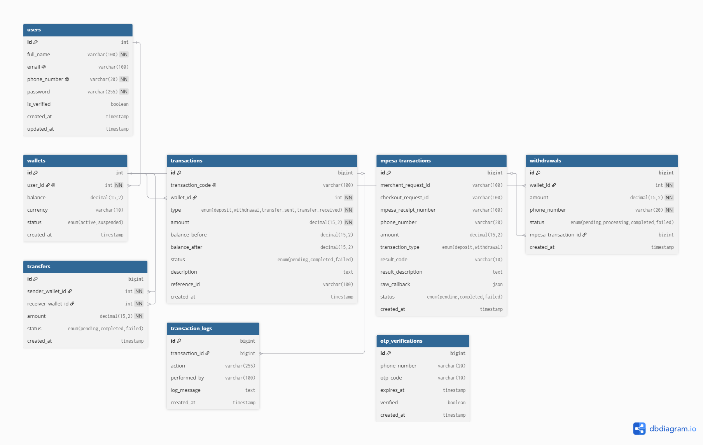

# MVP Wallet App

A full-stack wallet MVP built with a React + TypeScript frontend and an Express + TypeScript backend.
The project supports authentication, user profiles, wallet funding via M-Pesa, withdrawals, transfers, transaction history, and admin reporting.

## Project structure

- `client/` — React, Vite, TypeScript, Tailwind UI
- `server/` — Express API, Knex, MySQL, JWT auth, M-Pesa integration
- `docs/` — project assets, including the database ER diagram

## Technology stack

- Frontend: React 19, TypeScript, Vite, Tailwind CSS, React Router
- Backend: Express 5, TypeScript, Knex, MySQL, JWT, Winston, nodemailer
- Integrations: Safaricom M-Pesa Daraja sandbox webhooks

## Getting started

### Prerequisites

- Node.js 20+ and npm
- MySQL-compatible database
- A valid `.env` file in `server/` with database and M-Pesa credentials

### Install dependencies

```bash
cd server
npm install

cd ../client
npm install
```

### Configure environment

Copy `server/.env.example` to `server/.env` and fill in your values.

### Run the app locally

Start the backend:

```bash
cd server
npm run dev
```

Start the frontend:

```bash
cd client
npm run dev
```

The client expects the backend API to be available at `http://localhost:5000/api`. Update `client/src/lib/api.ts` if you need a different backend host.

## Backend scripts

From `server/`:

- `npm run dev` — run the server in development with hot reload
- `npm run build` — compile TypeScript to JavaScript
- `npm run start` — run the compiled server
- `npm run migrate:latest` — apply database migrations
- `npm run seed:run` — run seeders

## API overview

### Authentication

- `POST /api/auth/register` — create a new user
- `POST /api/auth/login` — authenticate and receive a JWT
- `POST /api/auth/verify-phone` — verify a phone OTP
- `POST /api/auth/resend-otp` — resend OTP code
- `GET /api/auth/me` — get current authenticated user
- `PATCH /api/auth/change-password` — change user password

### Wallet

- `GET /api/wallet` — fetch current wallet summary
- `POST /api/wallet/deposit` — initiate a deposit via M-Pesa
- `GET /api/wallet/deposit/status/:checkout_request_id` — poll M-Pesa deposit status
- `POST /api/wallet/withdraw` — initiate a withdrawal
- `GET /api/wallet/withdraw/status/:withdrawal_id` — check withdrawal status

### Transactions

- `GET /api/transactions` — list transactions with optional `page`, `limit`, `type`, `status`, `from`, and `to`
- `GET /api/transactions/statement` — get a date range statement
- `GET /api/transactions/:id` — get transaction details

### Transfers

- `POST /api/transfers/send` — send funds to another wallet
- `GET /api/transfers` — fetch transfer history

### Profile and dashboard

- `GET /api/profile` — fetch profile, wallet, referral, KYC, and settings data
- `GET /api/dashboard` — fetch dashboard metrics for authenticated users

### Admin

- `GET /api/admin/stats` — admin statistics
- `GET /api/admin/users` — list users
- `GET /api/admin/failed-transactions` — list failed transactions
- `GET /api/admin/logs` — list transaction logs
- `PATCH /api/admin/users/:userId/wallet-status` — update wallet status

### M-Pesa webhooks

These callbacks do not require auth because Safaricom calls them directly:

- `POST /api/mpesa/stk-callback`
- `POST /api/mpesa/b2c-callback`
- `POST /api/mpesa/b2c-timeout`

## Environment variables

The backend expects the following environment variables in `server/.env`:

- `NODE_ENV`
- `PORT`
- `DB_HOST`
- `DB_USER`
- `DB_PASSWORD`
- `DB_NAME`
- `DB_PORT`
- `JWT_SECRET`
- `JWT_EXPIRES_IN`
- `MPESA_CONSUMER_KEY`
- `MPESA_CONSUMER_SECRET`
- `MPESA_SHORTCODE`
- `MPESA_PASSKEY`
- `MPESA_B2C_SHORTCODE`
- `MPESA_B2C_INITIATOR_NAME`
- `MPESA_B2C_SECURITY_CREDENTIALS`
- `MPESA_BASE_URL`
- `MPESA_CALLBACK_BASE_URL`
- `OTP_EXPIRES_MINUTES`
- `MAIL_SERVICE`
- `MAIL_USER`
- `MAIL_PASSWORD`
- `ALLOWED_ORIGINS`

> Do not commit your real `.env` file into source control.

## Database and ER diagram

This app uses a relational schema with these core entities:

- `users` — application users with phone authentication and optional email
- `wallets` — each user has a wallet with balance and status
- `transactions` — deposits, withdrawals, transfers, and other wallet events
- `mpesa_transactions` — M-Pesa callback records
- `withdrawals` — withdrawal requests linked to wallets
- `transfers` — peer-to-peer wallet transfers
- `transaction_logs` — audit records for transaction state changes
- `otp_verifications` — OTP records for phone verification



## Notes

- The client currently hardcodes the API base URL to `http://localhost:5000/api` in `client/src/lib/api.ts`.
- The server enforces JWT Bearer auth and `ALLOWED_ORIGINS` for CORS.
- Admin endpoints are authenticated but do not currently include role-based authorization.

## Frontend screens

- Splash / onboarding
- Auth / login / register
- Dashboard
- Wallet details
- History and transaction statement
- Profile
- Admin reporting

## Useful commands

```bash
# Run backend
cd server
npm run dev

# Run frontend
cd client
npm run dev
```

## Author

Paul Onsongo
